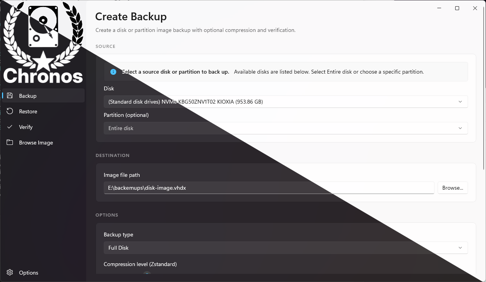

# Chronos

<div align="center">




**Modern Disk Imaging Utility for Windows**

[](https://www.gnu.org/licenses/gpl-3.0)
[](https://dotnet.microsoft.com/)
[](https://www.microsoft.com/windows)
[](https://github.com)

</div>

## 🚀 Overview

Chronos is a modern, open-source disk imaging utility for Windows with a beautiful WinUI3 interface. It provides simple, performant disk and partition backup, restore, verification, and browsing capabilities with VSS integration for live system backups.

### ✨ Key Features

- **🎨 Modern UI**: Beautiful WinUI3 interface with Acrylic/Mica effects
- **💾 Full & Partition Backup**: Backup entire disks or individual partitions
- **🔄 Disk Cloning**: Clone disks and partitions directly
- **📦 Fast Compression**: Zstandard compression for optimal speed and size
- **📸 VSS Integration**: Consistent backups of running Windows systems
- **✅ Verification**: Built-in image integrity checking and hash validation
- **📂 Image Browsing**: Mount VHDX images to explore contents
- **🌐 Cross-Architecture**: Native support for x86, x64, and ARM64

## 📋 Requirements

- **OS**: Windows 10 (version 1809+) or Windows 11
- **Architecture**: x86, x64, or ARM64
- **Privileges**: Administrator rights required for disk-level operations
- **.NET**: .NET 10 Runtime (included with installer)

## 🔧 Installation

### From Release

1. Download the latest `.msix` package from [Releases](https://github.com/yourusername/chronos/releases)
2. Double-click to install
3. Run Chronos from the Start Menu

### Build from Source

```powershell
# Clone the repository
git clone https://github.com/yourusername/chronos.git
cd chronos

# Restore dependencies and build
dotnet restore
dotnet build

# Run the application
dotnet run --project src/Chronos.App.csproj
```

## 📖 Usage

### Creating a Backup

1. Launch Chronos and navigate to the **Backup** page
2. Select backup type:
   - **Disk Backup**: Full disk image to VHDX
   - **Partition Backup**: Single partition to VHDX
   - **Disk Clone**: Direct disk-to-disk copy
   - **Partition Clone**: Direct partition-to-partition copy
3. Choose source and destination
4. Configure options (compression, VSS, verification)
5. Click **Start Backup**

### Restoring from Backup

1. Navigate to the **Restore** page
2. Select the VHDX image file
3. Choose the target disk or partition
4. Review safety warnings
5. Click **Start Restore**

### Verifying an Image

1. Navigate to the **Verify** page
2. Select the VHDX image file
3. Click **Verify** to check integrity
4. Optionally compute SHA-256 hash

### Browsing an Image

1. Navigate to the **Browse** page
2. Select the VHDX image file
3. Choose mount type:
   - **Drive Letter**: Mount as a drive (e.g., E:)
   - **Folder**: Mount to a specific folder
4. Browse contents normally in File Explorer
5. Click **Dismount** when finished

## 🏗️ Architecture

Chronos is built with a clean, modular architecture:

```
Chronos.App       → WinUI3 application with MVVM pattern
Chronos.Core      → Business logic, imaging engines
Chronos.Native    → P/Invoke wrappers for Windows APIs
Chronos.Common    → Shared utilities and extensions
```

### Key Technologies

- **WinUI3** - Modern Windows UI framework
- **.NET 10** - Latest .NET runtime
- **VSS** - Volume Shadow Copy Service for consistent snapshots
- **VHDX** - Native Windows virtual disk format
- **Zstandard** - Fast compression algorithm
- **MVVM** - Clean separation of concerns

## 🔍 Troubleshooting / Logs

When backup operations fail, check the log file for details (operation, Win32 error codes, and failing step):

- **Location**: `%LOCALAPPDATA%\Chronos\Logs\chronos-YYYYMMDD.log`
- **Win32 error codes**: 3 = path not found, 5 = access denied (run as admin), 87 = invalid parameter

## 🤝 Contributing

Contributions are welcome! Please see [CONTRIBUTING.md](CONTRIBUTING.md) for guidelines.

### Development Setup

1. Install [Visual Studio 2022](https://visualstudio.microsoft.com/) with:
   - .NET desktop development workload
   - Windows application development workload
2. Clone the repository
3. Open `Chronos.sln`
4. Build and run

## 📄 License

This project is licensed under the GNU General Public License v3.0 - see the [LICENSE](LICENSE) file for details.

## 🗺️ Roadmap

### Version 1.0 (Current)
- ✅ Full disk and partition backup
- ✅ Restore and clone operations
- ✅ VSS integration
- ✅ Zstandard compression
- ✅ Image verification
- ✅ Mount and browse

### Version 1.1 (Planned)
- 🔲 Incremental backups
- 🔲 Differential backups
- 🔲 Backup scheduling
- 🔲 Email notifications

### Version 2.0 (Future)
- 🔲 Bootable recovery media
- 🔲 WinPE integration
- 🔲 Cloud storage support
- 🔲 AES-256 encryption

## 📞 Support

- 🐛 [Report a Bug](https://github.com/yourusername/chronos/issues)
- 💡 [Request a Feature](https://github.com/yourusername/chronos/issues)
- 📧 Email: support@chronos.example.com

## 🙏 Acknowledgments

- [WinUI Community](https://github.com/microsoft/microsoft-ui-xaml) for the amazing UI framework
- [Zstandard](https://github.com/facebook/zstd) for the compression library
- All contributors who help make Chronos better!

---

<div align="center">
Made with ❤️ by the Chronos Team
</div>
